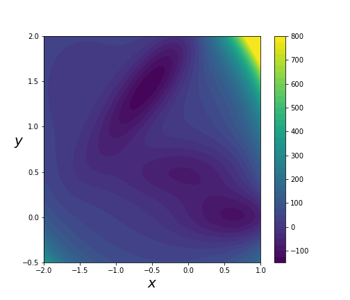

<br />
<div align="center">
    
  

<h3 align="center">Replica Exchange With Non-Equilibrium Switches</h3>

  <p align="center">
    An enhanced-sampling algorithm that increases acceptance probability by perfomring non-equilibrium work simulations.
    <br />
  </p>
</div>


<!-- TABLE OF CONTENTS -->
<details>
  <summary>Table of Contents</summary>
  <ol>
    <li>
      <a href="#about-the-project">About The Project</a>
    </li>
    <li>
      <a href="#getting-started">Getting Started</a>
    </li>
    <li><a href="#systems">Systems</a></li>
    <li><a href="#roadmap">Roadmap</a></li>
    <li><a href="#license">License</a></li>
    <li><a href="#contact">Contact</a></li>
    <li><a href="#acknowledgments">Acknowledgments</a></li>
  </ol>
</details>


<!-- ABOUT THE PROJECT -->
## About The Project

This repository was made with the intention of implementing a Molecular Dynamics algorithm written in 2009 by Prof. Jarzynski and Mr. Andrew Ballard, titled ["Replica Exchange with Non-Equilibrium Switches"](https://www.pnas.org/content/106/30/12224). It eventually became a module which not only did that, but also as a framework for attempting molecular dynamics simulations on any toy system.

<p align="right">(<a href="#top">back to top</a>)</p>


<!-- GETTING STARTED -->
## Getting Started

* Clone the repository : 
    ```
    git clone https://github.com/shaunak-badani/1D_MD.git
    ```
* Install [anaconda](https://docs.anaconda.com/anaconda/install/index.html) or [miniconda](https://docs.conda.io/projects/conda/en/latest/user-guide/install/linux.html) to manage the packages required to run this code.

* Use the `MD.yml` environment file to create an environment `MD` which contains all the packages required to run this module, and activate it. Some of the packages in the environment may not be required, like `openmm`, so you can manually remove them if there are space constraints.
    ```
    conda env create -f MD.yml
    conda activate MD
    ```

* Copy the following into a file `nve.json` : 
    ```
    {
        "num_particles": 10,
        "num_steps": 10000,
        "run_type": "nve",
        "files" : "."
    }
    ```
* Run the code with the json file, in the `Basic` directory : 
    ```
    cd Basic
    python3 main.py -c nve.json
    ```

* This creates a folder in the directory `Basic/`, by the name of the json file, `nve`.

* The folder contains the following files : 

    ```tree
    nve
    ├── end.rst
    ├── p.txt
    ├── scalars.txt
    └── v.txt
    ```

* The above mentioned folder contains data about the simulation that was just performed. More details on it are given below. Furthermore, analysis of the simulation can be performed using the following command : 
  ```
  cd Basic
  python3 analyze.py -c nve.json
  ```

* This creates a bunch of plots in `analysis_plots` folder, which help in analyzing the simulation. For the NVE run, it is sufficient to see the `energies` plot and check whether the total energy remained constant or not.

* Further options for the json file are given in the README in `Basic`.


## Systems 

The module implements a couple of interesting toy systems on which MD is performed. 


###  1-Dimensional Leach

This system contains a single particle moving in 1 direction, along the x-axis. It is a continuous version of the potential function as described in chapter 13 of Leach. Its potential, at any given point, is calculated using the graph below : 

 

This graph has three local minima, transitions between which are of great interest in studying Molecular Dynamics Algorithms.

If a system were to include multiple particles at once, they would be considered non-interacting particles, and the potential energy of the system would be the sum of potential energies of all particles on the surface.

### 2-Dimensional Muller Brown Potential

The Muller Brown potential is a combination of multiple gaussians in the 2-D plane. Its potential energy surface, or PES, looks like the following : 




There are two valleys separated by an energy barrier, which again makes this system of great interest.


<!-- ROADMAP -->
## Roadmap

- [] Implement Analysis objects for 2-D brown muller potential
- [] Benchmarking for RENS runs.


<!-- CONTRIBUTING -->
## Contributing

Contributions are what make the open source community such an amazing place to learn, inspire, and create. Any contributions you make are **greatly appreciated**.

If you have a suggestion that would make this better, please fork the repo and create a pull request. You can also simply open an issue with the tag "enhancement".
Don't forget to give the project a star! Thanks again!

1. Fork the Project
2. Create your Feature Branch (`git checkout -b feature/AmazingFeature`)
3. Commit your Changes (`git commit -m 'Add some AmazingFeature'`)
4. Push to the Branch (`git push origin feature/AmazingFeature`)
5. Open a Pull Request


<!-- LICENSE -->
## License

Distributed under the MIT License. See `LICENSE.txt` for more information.


<!-- ACKNOWLEDGMENTS -->
## Acknowledgments

* `snsinfu's` [Replica Exchange implementation](https://github.com/snsinfu/f95-replica-exchange) which gave inspiration to the REMD implementation in this module.
* sandeshkalantre, for his [Jarzynski repo](https://github.com/sandeshkalantre/jarzynski) which contains computational examples on proving Jarzynski's equality.

